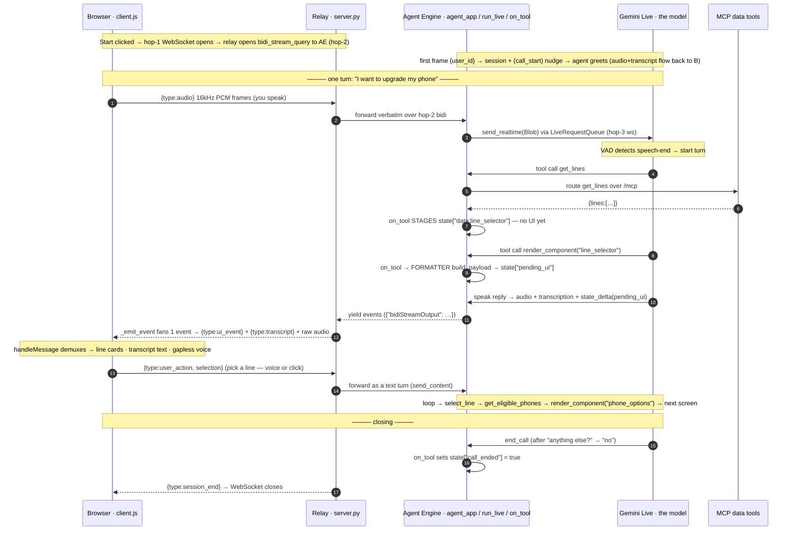

# 01 — Phone Upgrade (voice + chat)

Phone-upgrade agent on Google ADK + Gemini Live, in **two channels**:

- **Voice** — speak (or type a turn); the agent always replies in native audio (Gemini Live).
- **Chat** — type; a text model replies.

Both drive the **same** UI (line picker → phone options → confirmation → receipt) and **share one
session**, so you can start in one channel and continue in the other. Advance by voice, by typing,
or by clicking the cards. A **Mute** button stops mic audio without ending the call.

## What it is

A reference **multimodal sales/support agent** for a phone-upgrade journey: pick a line, choose an
eligible phone, confirm, get a receipt — all by conversation, with a synchronized on-screen UI. It
shows how **one streaming agent drives a real UI on the same stream as its speech** — no second LLM,
no orchestration hop. Runs locally in-process for dev and deploys to Google Cloud (Agent Engine +
Cloud Run) for a hosted demo, using the **same** wire protocol either way.

## Features

- **Two channels, one experience** — voice (Live native audio) and chat (text) render the same four
  screens through the same component code.
- **Shared session / cross-channel handoff** — both channels anchor on `user_id` and one session
  store, so a flow started in voice resumes in chat (and back) with conversation + picked line/phone.
- **Single-stream voice + UI** — the agent speaks while pushing JSON UI components on the same bidi
  stream, emitted as `pending_ui` state deltas.
- **Model-chosen, deterministic rendering** — the model picks *when* and *which* template via a
  `render_component` call; an `after_tool_callback` formatter fills it from state, so the model never
  hand-writes UI.
- **Dual input** — speak, type, or click the cards; all feed the same session state.
- **MCP data layer** — lines, phone catalog, pricing, and order placement served by a stateless MCP
  server; UI/session-control tools stay agent-local.
- **Mute control** — pause mic audio mid-call without ending the session.
- **Live transcripts** — streaming STT for both sides (deltas, then a cumulative final).
- **Local or cloud, no code change** — one env var (`AGENT_ENGINE_NAME`) flips the relay between
  in-process `run_live` and proxying to Agent Engine.
- **One-command deploy + teardown** — `deploy_all.sh` stands up the five-service stack;
  `destroy_all.sh` tears it down to stop billing.
- **Deploy verification probes** — scripts that prove a release end-to-end (voice, relay, resume,
  handoff).

## How it works — voice flow

The browser loads the page from the **UI** service, opens one WebSocket to the **relay**, which
proxies a bidi stream to the **voice agent** on Agent Engine. The agent calls the **MCP tools** for
data and emits each `render_component` as a `pending_ui` state delta — the model never hand-writes
UI. (Locally the relay runs the agent in-process via `run_live` — same wire protocol.)

```
        ┌──────────────────────────┐                                   ┌──────────────────────────┐
        │         BROWSER          │      WebSocket  /ws/{user}        │    Relay (Cloud Run)     │
        │  (page from UI service)  │ ───────────────────────────────▶  │        server.py         │
        │  client.js   (WS glue)   │   {type:audio}  16kHz PCM b64     │                          │
        │  audio.js    (mic 16kHz, │   {type:user_action, selection}   │  proxy: browser ⇄ AE     │
        │               play 24kHz)│                                   │  bidi_stream_query       │
        │  components.js (cards)   │ ◀───────────────────────────────  │  --min-instances 1       │
        │  config.js   (RELAY_URL) │   {type:ui_event}   component     │                          │
        │                          │   {type:transcript} you / agent   │                          │
        │                          │   raw event         24kHz audio   │                          │
        │                          │   {type:session_end}              │                          │
        └──────────────────────────┘                                   └────────────┬─────────────┘
                                                                          bidi to AE│  audio in/out
                                                                        (proxy mode)│  + state deltas
                                                                                    ▼
                                                                       ┌──────────────────────────┐
                                                                       │Voice agent (Agent Engine)│
                                                                       │ Gemini Live native audio │
                                                                       │  tools + after_tool_cb   │
                                                                       │  formatter → pending_ui  │
                                                                       └────────────┬─────────────┘
                                                      get_lines / get_phones / order│ MCP tool calls
                                                                                    ▼  streamable-HTTP /mcp
                                                                       ┌──────────────────────────┐
                                                                       │MCP data tools (Cloud Run)│
                                                                       │ FastMCP · lines · phones │
                                                                       │     pricing · order      │
                                                                       └──────────────────────────┘
```

One turn — *"I want to upgrade my phone"* — from mic to rendered screen. The two highlighted steps
are the heart of the design: tool **data is staged first** (no UI), and the screen is only **built
when the model calls `render_component`** — the model chooses when/which template, the formatter
renders deterministically.



**Wire protocol** (JSON text frames over the WebSocket):

| Direction | Message | Meaning |
|---|---|---|
| browser → relay | `{type:"audio", data}` | mic frame, 16 kHz mono PCM, base64 (half-duplex gated while the agent speaks) |
| browser → relay | `{type:"user_message", text}` | a typed turn, injected into the same Live session; the agent still **replies in voice**. The browser flushes queued playback first, so it barges in mid-sentence. |
| browser → relay | `{type:"user_action", selection}` | a card click; injected as an equivalent text turn |
| relay → browser | `{type:"ui_event", stage_intent, payload}` | the component to render (built by the formatter) |
| relay → browser | `{type:"transcript", role, text, final}` | live STT for both sides (deltas, then a cumulative `final`) |
| relay → browser | raw ADK event | model audio in `content.parts[].inlineData.data` (24 kHz, **base64url**) |
| relay → browser | `{type:"session_end"}` | agent ended the call; the relay closes the socket |

## Transport — three hops, not one connection

Voice needs audio flowing up (mic) and down (agent) at the same time, continuously — a normal HTTP
request can't. So every hop is a persistent two-way channel, but each uses a different transport, and
the live voice rides one hop deeper than expected.

```
   WebSocket                gRPC bidi stream              WebSocket
  (we open this)           (the platform's API)        (ADK opens this)
       │                          │                          │
┌──────────────┐         ┌──────────────┐          ┌──────────────┐         ┌──────────────┐
│   BROWSER    │◀───────▶│    RELAY     │◀────────▶│ AGENT ENGINE │◀───────▶│  GEMINI      │
│  client.js   │  ws://  │  server.py   │   bidi   │  agent_app   │   ws    │  LIVE API    │
│              │         │              │ _stream  │  run_live    │         │ (the model)  │
└──────────────┘         └──────────────┘ _query   └──────────────┘         └──────────────┘
   hop 1                    hop 2                      hop 3
   browser ⇄ relay          relay ⇄ Agent Engine       Agent Engine ⇄ model
                                                        ▲
                              the live voice actually rides on hop 3 —
                              opened by ADK inside the Agent Engine container
```

| Hop | Connection | What it is | Official docs |
|---|---|---|---|
| **1 · browser ⇄ relay** | WebSocket (JSON frames) | We open it — `new WebSocket(...)` in `client.js`, accepted by `ws_endpoint` in `backend/server.py`. The browser's only connection; never holds cloud credentials. | [MDN — WebSocket API](https://developer.mozilla.org/en-US/docs/Web/API/WebSockets_API) · [FastAPI — WebSockets](https://fastapi.tiangolo.com/advanced/websockets/) |
| **2 · relay ⇄ Agent Engine** | gRPC bidi stream (*not* a WebSocket) | The platform's API. Agent Engine exposes a `bidi_stream_query` op; the relay reaches it via the GenAI SDK over gRPC/HTTP/2. | [Agent Engine — Bidirectional streaming](https://docs.cloud.google.com/gemini-enterprise-agent-platform/scale/runtime/bidirectional-streaming) · [gRPC — Bidirectional streaming RPC](https://grpc.io/docs/what-is-grpc/core-concepts/#bidirectional-streaming-rpc) |
| **3 · Agent Engine ⇄ Gemini Live** | WebSocket (**carries the voice**) | Opened by ADK's `run_live` *inside* the Agent Engine container — where PCM audio reaches the model. | [ADK — Bidi-streaming dev guide](https://adk.dev/streaming/dev-guide/part1/) · [Gemini Live API overview](https://docs.cloud.google.com/gemini-enterprise-agent-platform/models/live-api) |

**Why a relay (hops 1 + 2):** credentials stay server-side, it translates the browser's JSON ⇄ the
Agent Engine stream, and flipping `AGENT_ENGINE_NAME` swaps hop 2 for in-process `run_live` — same
browser connection in local dev, no code change.

> Agent Engine docs moved under "Gemini Enterprise Agent Platform"; older `cloud.google.com/vertex-ai/...`
> links redirect to a landing page — use the links above.

## The chat channel

Chat mirrors voice with text, reusing the **same** MCP tools, `render_component` callbacks, and
`frontend/components.js` — same four screens. Only transport and model differ:

- **Frontend:** `frontend/chat.html` + `chat.js` (text composer, not a mic), same `components.js`.
- **Relay path:** browser opens `wss://<relay>/chat/{user_id}`; the relay proxies **one turn at a
  time** to the chat agent's `async_stream_query` op (request/response, not bidi).
- **Chat agent:** a **separate** Agent Engine on a text model (`CHAT_MODEL`, default
  `gemini-2.5-flash`) — not a Live model, so no hop-3 voice WebSocket.

**Shared session = cross-channel handoff.** Both agents point `VertexAiSessionService` at the same
`SESSION_ENGINE_ID`. Resume anchors on `user_id`: connect with a `user_id` and the server resumes
that user's latest session (`backend/session_resolve.py`) — voice ↔ chat, carrying the conversation
*and* the picked line/phone.

**Chat wire protocol** adds one browser→relay message; relay→browser is shared with voice:

| Direction | Message | Meaning |
|---|---|---|
| browser → relay | `{type:"user_message", text}` | a typed turn |
| browser → relay | `{type:"user_action", selection}` | a card click |
| relay → browser | `{type:"ui_event"}` / `{type:"transcript"}` / `{type:"session_end"}` | same as voice (no audio frames) |

## Running it

Three self-contained approaches (A, B, deploy) — **each repeats its full prerequisites** so you can
follow any one start-to-finish. All three need the local `.venv`: the deploy scripts run *on your
machine*, so the venv is required even for cloud deploys. Run everything from `01-phone-upgrade/`.

### Option A — adk web (quick voice/agent test)

ADK's built-in dev UI (voice + tool-call trace). Does NOT render the custom phone-upgrade cards.

```bash
# create and activate the local venv
python3 -m venv .venv && source .venv/bin/activate

# install dependencies
pip install -r requirements.txt

# ADC for Vertex
gcloud auth application-default login

# create .env, then set GOOGLE_CLOUD_PROJECT (+ region if not us-central1)
cp .env.example .env

# required for voice (TLS cert bundle)
export SSL_CERT_FILE=$(python -m certifi)

# launch the dev UI on :8001 — point at the agent folder
adk web phone_upgrade --port 8001
```

Open the printed URL, select `phone_upgrade`, click the mic.

> Pass the agent folder explicitly. Plain `adk web` from the module root lists every subdirectory
> (`backend`, `frontend`, `tests`) as bogus agents; pointing at `phone_upgrade` shows only the agent.

### Option B — FastAPI relay + custom UI (the full demo)

Runs the voice agent in-process and renders the real phone-upgrade cards.

```bash
# create and activate the local venv
python3 -m venv .venv && source .venv/bin/activate

# install dependencies
pip install -r requirements.txt

# ADC for Vertex
gcloud auth application-default login

# create .env, then set GOOGLE_CLOUD_PROJECT (+ region if not us-central1)
cp .env.example .env

# required for voice (TLS cert bundle)
export SSL_CERT_FILE=$(python -m certifi)
```

Data tools live in a separate MCP server, so start it first:

```bash
# MCP data tools — streamable-HTTP on :9000
python -m mcp_server.server

# relay (in-process agent) on :8000 — run from 01-phone-upgrade/
uvicorn backend.server:app --reload
```

```bash
# serve the frontend in another terminal, then open http://localhost:5500 and grant mic
cd frontend && python -m http.server 5500
```

> The agent reaches MCP via `MCP_SERVER_URL` (default `http://localhost:9000/mcp`).
> `render_component`/`end_call` stay agent-local; everything else is an MCP call. Keep adk web (8001)
> and the relay (8000) on different ports — the frontend expects the relay on :8000.

> **Chat locally:** voice runs in-process, but chat has no in-process mode — `/chat` always proxies to
> a deployed chat engine. To test `chat.html` locally, deploy a chat engine and set
> `CHAT_AGENT_ENGINE_NAME` (and `SESSION_ENGINE_ID`) before starting the relay.

### Deploy to Google Cloud (fully hosted)

One command stands up the **entire** stack — UI, relay, voice agent, chat agent, MCP — from a clean
project. All config comes from `.env`; nothing is hardcoded.

> The deploy runs on your machine: `deploy_all.sh` → `deploy/*.py` use the Vertex SDK locally to
> package the agents and trigger cloud builds, so the `.venv` with `requirements.txt` is required even
> for a cloud deploy.

```bash
# create and activate the local venv
python3 -m venv .venv && source .venv/bin/activate

# install local deploy tooling (incl. the Vertex SDK)
pip install -r requirements.txt

# ADC for the deploy
gcloud auth application-default login

# create .env, then set GOOGLE_CLOUD_PROJECT (+ region/names if you like)
cp .env.example .env

# enable the APIs the build uses (once per project)
gcloud services enable aiplatform.googleapis.com run.googleapis.com \
  cloudbuild.googleapis.com artifactregistry.googleapis.com storage.googleapis.com

# deploy the whole stack — prints the UI URL (cold build ~8–10 min)
deploy/deploy_all.sh
```

`deploy_all.sh` runs five steps in order, **threading each step's output into the next**: MCP →
captures its URL → **voice** agent (with that URL) → captures its engine id (shared session store) →
**chat** agent (pointed at that session id) → relay (both engine names) → UI (relay URL injected into
`config.js`). Open the printed **UI URL** (voice) or **`/chat.html`** (chat) and click **Start**.

```bash
# tear it all down — stops billing (3 Cloud Run services, both Agent Engines, the bucket)
deploy/destroy_all.sh
```

Verify a release (optional):

```bash
# required for voice (TLS cert bundle)
export SSL_CERT_FILE=$(python -m certifi)

# voice agent + MCP, direct to Agent Engine → 4 screens + audio
python deploy/probe_agent_engine.py

# browser → relay → AE path → 4 screens + audio
RELAY_WSS=wss://<relay-host> python deploy/probe_relay_ws.py

# resume by user_id across reconnects (no re-greet, no stale screen)
python deploy/probe_resume.py

# cross-channel: start in voice → resume in chat on the shared session
python deploy/probe_handoff.py
```

#### The five services

| # | Service | Platform | What it does |
|---|---|---|---|
| 1 | **MCP data tools** (`att-mcp-phone-upgrade`) | Cloud Run · FastMCP | Stateless data API at `/mcp` — account lines, phone catalog, pricing, order placement. The agents' only data source. |
| 2 | **Voice agent** (`att-phone-upgrade-live`) | Agent Engine | Gemini Live native-audio agent (bidi): listens, talks, calls MCP, emits `render_component` as `pending_ui`. Custom `bidi_stream_query` mode. Its engine id is the **shared session store**. |
| 3 | **Chat agent** (`att-phone-upgrade-chat`) | Agent Engine | Text model (`CHAT_MODEL`) on a **separate** engine, same tools + `render_component`. Standard `async_stream_query` op. Set to the voice engine's `SESSION_ENGINE_ID` for shared sessions. |
| 4 | **Relay** (`att-phone-upgrade-relay`) | Cloud Run | The single browser endpoint. `/ws/{user}` proxies the voice bidi stream; `/chat/{user}` proxies chat `async_stream_query`. Kept warm (`--min-instances 1`). |
| 5 | **UI** (`att-phone-upgrade-ui`) | Cloud Run | Static frontend — `index.html` (voice, mic + Mute) and `chat.html` (text), shared `components.js`. HTTPS (mic works); `no-store` (`serve.py`) so redeploys aren't cached; relay URL injected into `config.js`. |

The **topology toggle** is in `backend/server.py`: with `AGENT_ENGINE_NAME` set, voice proxies to
Agent Engine; unset, it runs in-process via `run_live` (option B). `/chat` always proxies to the
deployed chat engine (`CHAT_AGENT_ENGINE_NAME`). Same wire protocol either way.

#### Prerequisites

- **APIs:** `aiplatform`, `run`, `cloudbuild`, `artifactregistry`, `storage`.
- **IAM:** the Cloud Run runtime SA needs Agent Engine access (`roles/aiplatform.user`, or the
  default compute SA's `roles/editor`).
- **`.env` set** (below) and **ADC** configured.

#### Config (`.env`)

| Var | Purpose |
|---|---|
| `GOOGLE_CLOUD_PROJECT` | **required** — target project |
| `GOOGLE_CLOUD_LOCATION` | region (default `us-central1`) |
| `LIVE_MODEL`, `LIVE_VOICE` | voice Live model id + prebuilt voice |
| `CHAT_MODEL` | chat agent text model (default `gemini-2.5-flash`) |
| `SESSION_ENGINE_ID` | the ONE engine id both channels use as the shared session store (set automatically by `deploy_all.sh`; set it yourself only for partial deploys) |
| `MCP_SERVICE`, `RELAY_SERVICE`, `UI_SERVICE` | Cloud Run service names |
| `AGENT_DISPLAY_NAME`, `CHAT_DISPLAY_NAME` | Agent Engine display names (voice / chat) |
| `AE_STAGING_BUCKET` | staging bucket (default `<project>-agent-engine`) |
| `RELAY_MIN_INSTANCES` | keep a relay warm (default `1`; `0` to save cost) |
| `MCP_SERVER_URL`, `AGENT_ENGINE_NAME`, `CHAT_AGENT_ENGINE_NAME` | produced by the deploy — don't hand-set |

#### What each step runs (manual/partial deploys)

1. **MCP** — `gcloud run deploy $MCP_SERVICE --source mcp_server …` → captures `MCP_SERVER_URL`.
2. **Voice agent** — `python deploy/deploy_agent_engine.py` packages `backend/`, wires `MCP_SERVER_URL`,
   deploys EXPERIMENTAL mode (required for bidi) with `python_version=3.12`. Don't set the reserved
   `GOOGLE_CLOUD_PROJECT` on the engine. Its engine id becomes `SESSION_ENGINE_ID`.
3. **Chat agent** — `python deploy/deploy_chat_engine.py` with `SESSION_ENGINE_ID` set → separate
   engine on `CHAT_MODEL`, standard mode → captures `CHAT_AGENT_ENGINE_NAME`.
4. **Relay** — `gcloud run deploy $RELAY_SERVICE --source . …` with `AGENT_ENGINE_NAME` **and**
   `CHAT_AGENT_ENGINE_NAME` set → proxy mode for both channels.
5. **UI** — `gcloud run deploy $UI_SERVICE --source frontend …` (HTTPS → mic), relay URL injected into
   `config.js` first.

## Test

```bash
# run the test suite from 01-phone-upgrade/
pytest tests/ -v
```
