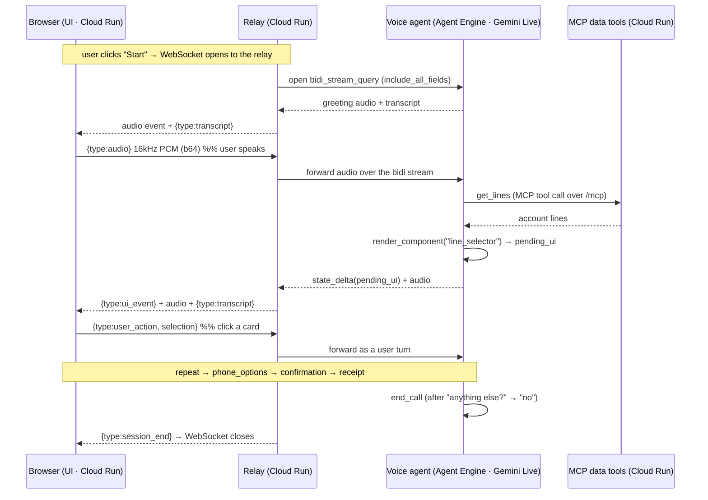

# 01 — Phone Upgrade (voice)

Voice phone-upgrade agent on Google ADK + Gemini Live. Speak naturally; the agent
talks back **and** drives an on-screen UI (line picker → phone options → confirmation
→ receipt). You can advance the flow by **voice or by clicking** the cards.

## How it works — end-to-end flow

Four cloud services, one WebSocket. The browser loads the page from the **UI** service, then
opens a single WebSocket to the **relay**, which proxies a bidi stream to the **voice agent** on
Agent Engine; the agent calls the **MCP tools** for data and emits each `render_component` as a
`pending_ui` state delta — the model never hand-writes UI. (Locally the relay runs the agent
in-process via `run_live` instead of proxying — same wire protocol; see the topology toggle below.)

```
        ┌──────────────────────────┐                                   ┌──────────────────────────┐
        │         BROWSER          │      WebSocket  /ws/{user}        │    Relay (Cloud Run)     │
        │  (page from UI service)  │ ───────────────────────────────▶  │        server.py         │
        │  client.js   (WS glue)   │   {type:audio}  16kHz PCM b64     │                          │
        │  audio.js    (mic 16kHz, │   {type:user_action, selection}   │  proxy: browser ⇄ AE     │
        │               play 24kHz)│                                   │  bidi_stream_query       │
        │  components.js (cards)   │ ◀───────────────────────────────  │  --min-instances 1       │
        │  config.js   (RELAY_URL) │   {type:ui_event}   component     │                          │
        │                          │   {type:transcript} you / agent   │                          │
        │                          │   raw event         24kHz audio   │                          │
        │                          │   {type:session_end}              │                          │
        └──────────────────────────┘                                   └────────────┬─────────────┘
                                                                          bidi to AE│  audio in/out
                                                                        (proxy mode)│  + state deltas
                                                                                    ▼
                                                                       ┌──────────────────────────┐
                                                                       │Voice agent (Agent Engine)│
                                                                       │ Gemini Live native audio │
                                                                       │  tools + after_tool_cb   │
                                                                       │  formatter → pending_ui  │
                                                                       └────────────┬─────────────┘
                                                      get_lines / get_phones / order│ MCP tool calls
                                                                                    ▼  streamable-HTTP /mcp
                                                                       ┌──────────────────────────┐
                                                                       │MCP data tools (Cloud Run)│
                                                                       │ FastMCP · lines · phones │
                                                                       │     pricing · order      │
                                                                       └──────────────────────────┘
```



**Wire protocol** (JSON text frames over the WebSocket):

| Direction | Message | Meaning |
|---|---|---|
| browser → relay | `{type:"audio", data}` | mic frame, 16 kHz mono PCM, base64 (gated half-duplex while the agent speaks) |
| browser → relay | `{type:"user_action", selection}` | a card click; injected as an equivalent text turn |
| relay → browser | `{type:"ui_event", stage_intent, payload}` | the component to render (built by the formatter) |
| relay → browser | `{type:"transcript", role, text, final}` | live STT for both sides (deltas, then a cumulative `final`) |
| relay → browser | raw ADK event | carries model audio in `content.parts[].inlineData.data` (24 kHz, **base64url**) |
| relay → browser | `{type:"session_end"}` | agent ended the call; the relay closes the socket |

## The transport model — three hops, not one connection

Voice needs audio flowing **up** (your mic) and **down** (the agent's voice) *at the same time,
continuously*. A normal HTTP request can't do that — it's one question, one answer, then it hangs up.
So every hop in this system is a **persistent, two-way channel**. But they are not all the same kind of
channel, and the connection that actually carries the live voice is one hop deeper than most people expect.

```
   WebSocket                gRPC bidi stream              WebSocket
  (we open this)           (the platform's API)        (ADK opens this)
       │                          │                          │
┌──────────────┐         ┌──────────────┐          ┌──────────────┐         ┌──────────────┐
│   BROWSER    │◀───────▶│    RELAY     │◀────────▶│ AGENT ENGINE │◀───────▶│  GEMINI      │
│  client.js   │  ws://  │  server.py   │   bidi   │  agent_app   │   ws    │  LIVE API    │
│              │         │              │ _stream  │  run_live    │         │ (the model)  │
└──────────────┘         └──────────────┘ _query   └──────────────┘         └──────────────┘
   hop 1                    hop 2                      hop 3
   browser ⇄ relay          relay ⇄ Agent Engine       Agent Engine ⇄ model
                                                        ▲
                              the live voice actually rides on hop 3 —
                              opened by ADK inside the Agent Engine container
```

Each hop uses a different transport for a different reason. Read the official docs for each:

| Hop | Connection | What it is | Official docs |
|---|---|---|---|
| **1 · browser ⇄ relay** | WebSocket (JSON frames) | We open this — `new WebSocket(...)` in `client.js`, accepted by `ws_endpoint` in `backend/server.py`. The only connection the browser has; it never holds cloud credentials. | [MDN — WebSocket API](https://developer.mozilla.org/en-US/docs/Web/API/WebSockets_API) · [FastAPI — WebSockets](https://fastapi.tiangolo.com/advanced/websockets/) |
| **2 · relay ⇄ Agent Engine** | gRPC bidirectional stream (*not* a WebSocket) | The platform's API, not our choice. Agent Engine exposes a registered `bidi_stream_query` op; the relay reaches it through the GenAI SDK over gRPC/HTTP/2. | [Agent Engine — Bidirectional streaming](https://docs.cloud.google.com/gemini-enterprise-agent-platform/scale/runtime/bidirectional-streaming) · [gRPC — Bidirectional streaming RPC](https://grpc.io/docs/what-is-grpc/core-concepts/#bidirectional-streaming-rpc) |
| **3 · Agent Engine ⇄ Gemini Live** | WebSocket (**carries the voice**) | Opened by ADK's `run_live` *inside* the Agent Engine container — this is where the PCM audio actually reaches the model. | [ADK — Bidi-streaming dev guide](https://adk.dev/streaming/dev-guide/part1/) · [Gemini Live API overview](https://docs.cloud.google.com/gemini-enterprise-agent-platform/models/live-api) |

**Why a relay in the middle at all (hops 1 + 2):** credentials stay server-side; the relay translates the
browser's simple JSON ⇄ the Agent Engine stream format; and flipping one env var (`AGENT_ENGINE_NAME`)
swaps hop 2 for an in-process `run_live`, so the *same* browser connection works in local dev with no
code change.

> Agent Engine docs were reorganized under "Gemini Enterprise Agent Platform" — older
> `cloud.google.com/vertex-ai/...` links now redirect to a generic landing page; use the links above.

## Setup (ADC / Vertex AI)
1. `python -m venv .venv && source .venv/bin/activate`
2. `pip install -r requirements.txt`
3. `gcloud auth application-default login`
4. `cp .env.example .env` and set `GOOGLE_CLOUD_PROJECT` (and region if not us-central1).

## Run — option A: adk web (quick agent/voice test, generic dev UI)
Shows ADK's built-in dev UI (voice + tool-call trace). Does NOT render the custom phone-upgrade cards.
```
export SSL_CERT_FILE=$(python -m certifi)   # required for voice
adk web phone_upgrade --port 8001           # point at the agent folder
```
Open the printed URL, select `phone_upgrade`, click the mic.

> Pass the agent folder (`phone_upgrade`) explicitly. Plain `adk web` from the module root lists every subdirectory (`backend`, `frontend`, `tests`) as bogus agents; pointing at the single agent folder shows only `phone_upgrade`.

## Run — option B: FastAPI relay + custom UI (the full demo)
The data tools are served by a separate MCP server, so start it first:
```
python -m mcp_server.server                 # MCP data tools, streamable-HTTP on :9000
uvicorn backend.server:app --reload         # :8000  (run from 01-phone-upgrade/)
```
In another terminal: `cd frontend && python -m http.server 5500`, open http://localhost:5500, grant mic.

> The agent reaches the MCP server via `MCP_SERVER_URL` (default `http://localhost:9000/mcp`). `render_component`/`end_call` stay agent-local; everything else is an MCP call.

> Run adk web and the relay on different ports (adk web on 8001, relay on 8000) — the frontend expects the relay on :8000.

## Deploy to Google Cloud (fully hosted)

One command stands the **entire** stack up on Google Cloud — UI, relay, voice agent,
and MCP tools — from a clean project. All config comes from `.env`; nothing is hardcoded.

```bash
cp .env.example .env                        # set GOOGLE_CLOUD_PROJECT (+ region/names if you like)
gcloud auth application-default login       # ADC for the deploy
deploy/deploy_all.sh                         # builds + deploys everything, prints the UI URL
```

`deploy_all.sh` runs the four hops in order and **threads each step's output into the next**
(no hand-wiring): MCP → captures its URL → agent on Agent Engine (with that URL) → captures the
engine id → relay (with the engine name) → UI (with the relay URL injected into `config.js`).
Typical cold build is ~7–8 min. Open the printed **UI URL** and click **Start**.

Tear it **all** back down (stops billing — deletes the 3 Cloud Run services, the Agent Engine, and the bucket):

```bash
deploy/destroy_all.sh
```

**Verify the deployment** (optional — what proves a release):

```bash
export SSL_CERT_FILE=$(python -m certifi)
python deploy/probe_agent_engine.py         # agent + MCP, direct to Agent Engine → 4 screens + audio
RELAY_WSS=wss://<relay-host> python deploy/probe_relay_ws.py   # browser → relay → AE path → 4 screens + audio
```

### The four services

`deploy_all.sh` deploys these in order, threading each one's output into the next:

| # | Service | Platform | What it does |
|---|---|---|---|
| 1 | **MCP data tools** (`att-mcp-phone-upgrade`) | Cloud Run · FastMCP | Stateless data API at `/mcp` — looks up account lines, phone catalog, pricing, and places the order. The agent's only data source. |
| 2 | **Voice agent** (`att-phone-upgrade-live`) | Vertex AI Agent Engine | The brain. Gemini Live native-audio agent (bidi) that listens, talks, calls the MCP tools, and emits each `render_component` as a `pending_ui` state delta. Custom `bidi_stream_query` server mode. |
| 3 | **Relay** (`att-phone-upgrade-relay`) | Cloud Run | The single endpoint the browser connects to. Proxies the browser WebSocket ⇄ the agent's bidi stream; translates events into the browser wire protocol. Kept warm (`--min-instances 1`) to avoid cold-start 503s. |
| 4 | **UI** (`att-phone-upgrade-ui`) | Cloud Run | Static frontend (mic capture + card rendering). Served over HTTPS so the mic works; the relay URL is injected into `config.js` at deploy time. |

The **relay topology toggle** lives in `backend/server.py`: with `AGENT_ENGINE_NAME` set it proxies to
Agent Engine (cloud, above); unset, it runs the agent in-process via `run_live` (local dev, option B).
Same browser wire protocol either way — see the table above.

### Prerequisites

- **APIs enabled:** `aiplatform`, `run`, `cloudbuild`, `artifactregistry`, `storage`.
- **IAM:** the Cloud Run runtime service account needs Agent Engine access
  (`roles/aiplatform.user`, or the default compute SA's `roles/editor`) so the relay can reach the agent.
- **`.env` set** (see below) and **ADC** configured (`gcloud auth application-default login`).

### Config (`.env`)

| Var | Purpose |
|---|---|
| `GOOGLE_CLOUD_PROJECT` | **required** — target project |
| `GOOGLE_CLOUD_LOCATION` | region (default `us-central1`) |
| `LIVE_MODEL`, `LIVE_VOICE` | Live model id + prebuilt voice |
| `MCP_SERVICE`, `RELAY_SERVICE`, `UI_SERVICE` | Cloud Run service names |
| `AGENT_DISPLAY_NAME` | Agent Engine display name |
| `AE_STAGING_BUCKET` | staging bucket (default `<project>-agent-engine`) |
| `RELAY_MIN_INSTANCES` | keep a relay warm (default `1`; `0` to save cost) |
| `MCP_SERVER_URL`, `AGENT_ENGINE_NAME` | produced by the deploy script — don't hand-set |

### What each step runs (for manual/partial deploys)

1. **MCP** — `gcloud run deploy $MCP_SERVICE --source mcp_server …` → captures its URL as `MCP_SERVER_URL`.
2. **Agent** — `python deploy/deploy_agent_engine.py` packages `backend/` as source, wires `MCP_SERVER_URL`,
   deploys in EXPERIMENTAL server mode (required for bidi) with `python_version=3.12` (no py3.14 base image).
   Do **not** set the reserved `GOOGLE_CLOUD_PROJECT` env var on the engine. (Preview; ~10-min/stream limit.)
3. **Relay** — `gcloud run deploy $RELAY_SERVICE --source . …` with `AGENT_ENGINE_NAME` set → proxy mode.
4. **UI** — `gcloud run deploy $UI_SERVICE --source frontend …` (HTTPS → mic works), relay URL injected into `config.js` first.

## Test
`pytest tests/ -v` (from `01-phone-upgrade/`)
