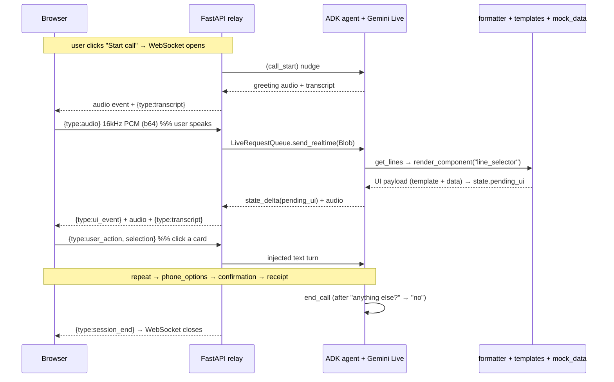
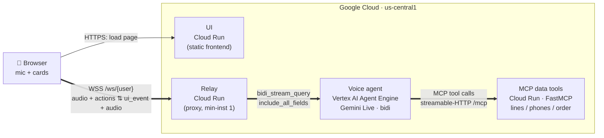

# 01 — Phone Upgrade (voice)

Voice phone-upgrade agent on Google ADK + Gemini Live. Speak naturally; the agent
talks back **and** drives an on-screen UI (line picker → phone options → confirmation
→ receipt). You can advance the flow by **voice or by clicking** the cards.

## How it works — end-to-end flow

Three hops: **browser ⇄ FastAPI relay ⇄ Gemini Live**. A deterministic formatter turns
each `render_component` tool call into the UI JSON the browser renders — the model never
hand-writes UI.

```
        ┌──────────────────────────┐                                   ┌──────────────────────────┐
        │         BROWSER          │      WebSocket  /ws/{user}         │      FastAPI relay       │
        │                          │ ───────────────────────────────▶  │       (server.py)        │
        │  client.js   (WS glue)   │   {type:audio}  16kHz PCM b64     │                          │
        │  audio.js    (mic 16kHz, │   {type:user_action, selection}   │   Runner.run_live (BIDI) │
        │               play 24kHz)│                                   │   LiveRequestQueue       │
        │  components.js (cards)    │ ◀─────────────────────────────── │                          │
        │                          │   {type:ui_event}   component     │                          │
        │                          │   {type:transcript} you / agent   │                          │
        │                          │   raw event         24kHz audio   │                          │
        │                          │   {type:session_end}              │                          │
        └──────────────────────────┘                                   └────────────┬─────────────┘
                                                                          run_live   │  audio in/out
                                                                          tool calls │  + state deltas
                                                                                     ▼
                                                                       ┌──────────────────────────┐
                                                                       │  ADK LlmAgent (agent.py) │
                                                                       │  Gemini Live native audio│
                                                                       │  tools + after_tool_cb   │
                                                                       └────────────┬─────────────┘
                                                       render_component(stage_intent)│ after_tool_callback
                                                                                     ▼
                                                                       ┌──────────────────────────┐
                                                                       │ formatter + templates +  │
                                                                       │ mock_data → ui_event JSON│
                                                                       └──────────────────────────┘
```



**Wire protocol** (JSON text frames over the WebSocket):

| Direction | Message | Meaning |
|---|---|---|
| browser → relay | `{type:"audio", data}` | mic frame, 16 kHz mono PCM, base64 (gated half-duplex while the agent speaks) |
| browser → relay | `{type:"user_action", selection}` | a card click; injected as an equivalent text turn |
| relay → browser | `{type:"ui_event", stage_intent, payload}` | the component to render (built by the formatter) |
| relay → browser | `{type:"transcript", role, text, final}` | live STT for both sides (deltas, then a cumulative `final`) |
| relay → browser | raw ADK event | carries model audio in `content.parts[].inlineData.data` (24 kHz, **base64url**) |
| relay → browser | `{type:"session_end"}` | agent ended the call; the relay closes the socket |

## Setup (ADC / Vertex AI)
1. `python -m venv .venv && source .venv/bin/activate`
2. `pip install -r requirements.txt`
3. `gcloud auth application-default login`
4. `cp .env.example .env` and set `GOOGLE_CLOUD_PROJECT` (and region if not us-central1).

## Run — option A: adk web (quick agent/voice test, generic dev UI)
Shows ADK's built-in dev UI (voice + tool-call trace). Does NOT render the custom phone-upgrade cards.
```
export SSL_CERT_FILE=$(python -m certifi)   # required for voice
adk web phone_upgrade --port 8001           # point at the agent folder
```
Open the printed URL, select `phone_upgrade`, click the mic.

> Pass the agent folder (`phone_upgrade`) explicitly. Plain `adk web` from the module root lists every subdirectory (`backend`, `frontend`, `tests`) as bogus agents; pointing at the single agent folder shows only `phone_upgrade`.

## Run — option B: FastAPI relay + custom UI (the full demo)
The data tools are served by a separate MCP server, so start it first:
```
python -m mcp_server.server                 # MCP data tools, streamable-HTTP on :9000
uvicorn backend.server:app --reload         # :8000  (run from 01-phone-upgrade/)
```
In another terminal: `cd frontend && python -m http.server 5500`, open http://localhost:5500, grant mic.

> The agent reaches the MCP server via `MCP_SERVER_URL` (default `http://localhost:9000/mcp`). `render_component`/`end_call` stay agent-local; everything else is an MCP call.

> Run adk web and the relay on different ports (adk web on 8001, relay on 8000) — the frontend expects the relay on :8000.

## Deploy to Google Cloud (fully hosted)

One command stands the **entire** stack up on Google Cloud — UI, relay, voice agent,
and MCP tools — from a clean project. All config comes from `.env`; nothing is hardcoded.

```bash
cp .env.example .env                        # set GOOGLE_CLOUD_PROJECT (+ region/names if you like)
gcloud auth application-default login       # ADC for the deploy
deploy/deploy_all.sh                         # builds + deploys everything, prints the UI URL
```

`deploy_all.sh` runs the four hops in order and **threads each step's output into the next**
(no hand-wiring): MCP → captures its URL → agent on Agent Engine (with that URL) → captures the
engine id → relay (with the engine name) → UI (with the relay URL injected into `config.js`).
Typical cold build is ~7–8 min. Open the printed **UI URL** and click **Start**.

Tear it **all** back down (stops billing — deletes the 3 Cloud Run services, the Agent Engine, and the bucket):

```bash
deploy/destroy_all.sh
```

**Verify the deployment** (optional — what proves a release):

```bash
export SSL_CERT_FILE=$(python -m certifi)
python deploy/probe_agent_engine.py         # agent + MCP, direct to Agent Engine → 4 screens + audio
RELAY_WSS=wss://<relay-host> python deploy/probe_relay_ws.py   # browser → relay → AE path → 4 screens + audio
```

### How it works — cloud end-to-end

Every hop runs in Google Cloud. The browser only ever talks to the **relay** (one WebSocket);
the relay proxies to the **voice agent** on Agent Engine, which calls the **MCP tools** for data.

```
   Google Cloud  ·  project = $GOOGLE_CLOUD_PROJECT  ·  region = us-central1
  ┌──────────┐   HTTPS    ┌──────────────────┐  WSS /ws/{user}   ┌──────────────────┐
  │   Your   │ ─────────▶ │  UI              │ ────────────────▶ │  Relay           │
  │ browser  │   load     │  Cloud Run       │  audio + actions  │  Cloud Run       │
  │ (mic +   │            │  (static front)  │                   │  (proxy mode,    │
  │  cards)  │ ◀───────── │                  │ ◀──────────────── │   min-instances 1)│
  └──────────┘  page+JS   └──────────────────┘  ui_event+audio   └────────┬─────────┘
       ▲                                                  bidi_stream_query │
       │  one WebSocket carries it all:                  include_all_fields │
       │  16 kHz mic PCM up · card clicks up                                ▼
       │  ui_event + 24 kHz audio + transcripts down       ┌──────────────────────┐
       └──────────────────────────────────────────────────│  Voice agent         │
                                                           │  Vertex AI Agent     │
                                                           │  Engine (Gemini Live,│
                                                           │  native audio, bidi) │
                                                           └──────────┬───────────┘
                                              MCP tool calls (streamable-HTTP /mcp) │
                                                                                    ▼
                                                           ┌──────────────────────┐
                                                           │  MCP data tools      │
                                                           │  Cloud Run (FastMCP) │
                                                           │  lines · phones ·    │
                                                           │  pricing · order     │
                                                           └──────────────────────┘
```



The **relay topology toggle** is in `backend/server.py`: with `AGENT_ENGINE_NAME` set it proxies to
Agent Engine (cloud, above); unset, it runs the agent in-process via `run_live` (local dev, option B).
Same browser wire protocol either way — see the table above. Full deploy reference: [`DEPLOY.md`](DEPLOY.md).

## Test
`pytest tests/ -v` (from `01-phone-upgrade/`)
