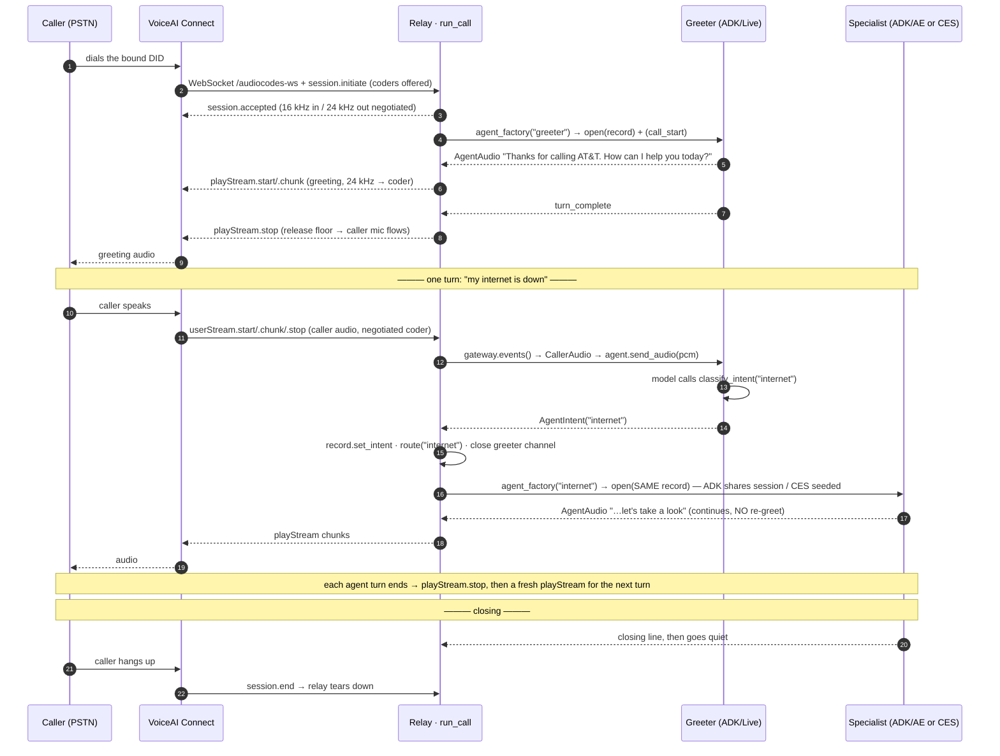

# AudioCodes → Multi-Agent Voice Steering

One inbound voice call, steered across **multiple AI back-ends on different platforms** — with no
audible re-greeting at each handoff. A caller dials in, a **greeter** classifies intent on the first
utterance, and the relay swaps the live audio to the right **specialist** — internet or phone-upgrade
(ADK + Gemini Live on Agent Engine) or billing (CX Agent Studio / CES) — while the caller hears one
continuous conversation. The routing decision is invisible.

A real PSTN call enters through **AudioCodes VoiceAI Connect** (Live Hub self-service), which streams
the call to the relay over the Bot API WebSocket — the greeter plus all three specialist routes
(internet / phone_upgrade / billing) answer a live phone call today. The same relay also accepts a
**browser mic harness** behind the identical `MediaGateway` port, so the full steering stack is also
runnable for local development with no telephony infrastructure.

## What it is

A reference **steering relay** that proves two things:

1. **A single voice session can be routed to a specialist on _any_ GCP platform, seamlessly** —
   demonstrated by routing to agents hosted two different ways (ADK + Gemini Live, and CX Agent
   Studio) behind one identical relay. The relay's caller side, steering, and bookkeeping are the
   same regardless of back-end; only the per-agent `AgentSession` implementation differs. That
   sameness *is* the cross-platform proof.
2. **AudioCodes works as the media path over WebSockets** — the relay's caller side is written
   against a `MediaGateway` port, implemented by `AudioCodesGateway` over the AudioCodes VoiceAI
   Connect (VAIC) Bot API. A browser harness implements the same port for local development.

See `DESIGN.md` for the full spec.

## Features

- **Seamless linear handoff** — the specialist continues the caller's conversation with **no
  re-greeting** and no "welcome back". WS to the caller never drops; only the back-end channel is
  re-pointed.
- **Two ports, two drop-ins** — the relay core talks to a `MediaGateway` (caller side) and an
  `AgentSession` (agent side). Harness↔AudioCodes and ADK↔CES are each a port swap, not a rewrite.
- **Cross-platform agents behind one relay** — ADK/Gemini-Live specialists (Agent Engine) and a CES
  billing agent (`BidiRunSession`) are reached through the identical steering loop.
- **First-turn intent routing** — a one-shot greeter classifies intent via a tool call, then goes
  silent; after the swap the relay is a cheap audio pump and the specialist does the work.
- **Session-of-record** — the relay owns one `SessionRecord` per call. ADK specialists inherit the
  greeter's turns via a **shared session**; the CES specialist is **seeded** from the same record via
  `historicalContexts` (a different mechanism per boundary, by design).
- **Local or cloud, no code change** — one env var (`AE_ENGINE_ID`) flips the ADK agents between
  **in-process** `run_live` (local dev) and **Agent Engine** `bidi_stream_query` (hosted).
- **One-command deploy** — `deploy/deploy_all.sh` stands up the Agent Engine app + Cloud Run relay
  (idempotent, update-in-place); `deploy/destroy.sh` tears it down.
- **Smoke probes** — `tests/smoke/smoke_*.py` verify each back-end channel end-to-end (CES bidi, ADK
  in-process, Agent Engine bidi) and the AudioCodes Bot API protocol, without a live phone.

## How it works — voice flow

A caller dials the bound DID. **AudioCodes VoiceAI Connect** (Live Hub) answers the PSTN leg and opens
**one WebSocket** to the relay (`/audiocodes-ws`), speaking the Bot API streaming protocol. The relay
owns that connection (`AudioCodesGateway`, a `MediaGateway`), runs the **steering loop**, and opens a
**back-end voice channel** (`AgentSession`) to whichever agent is active. The greeter classifies intent
on the first turn; the relay closes the greeter channel and opens the specialist channel **on the same
session** — the caller hears one continuous voice.

```
   PSTN caller  — dials the bound DID
         |
         |  voice
         v
   ┌──────────────────────────────────────────────────┐
   │ AudioCodes VoiceAI Connect   ·   Live Hub        │
   │ Bot API  ·  streaming (raw audio)                │
   │                                                  │
   │ telephony  <->  bot                              │
   │ caller audio  —  mu-law / 8 / 16 / 24 kHz        │
   └──────────────────────────────────────────────────┘
         |
         |   WebSocket   wss://<host>/audiocodes-ws   (Bearer AUDIOCODES_TOKEN)
         |
         |      bot  <--  session.initiate    ·   userStream.start / .chunk / .stop
         |      bot  -->  session.accepted    ·   playStream.start / .chunk / .stop
         v
   ┌──────────────────────────────────────────────────────────────────────┐
   │ RELAY    ·    Cloud Run    ·    relay/server.py                      │
   │                                                                      │
   │ AudioCodesGateway   (MediaGateway)                                   │
   │     handshake        ->  session.accepted                            │
   │     coders:  16 kHz in   /   24 kHz out   (agent-native)             │
   │     userStream       ->  decode  ->  16 kHz PCM                      │
   │     agent 24 kHz PCM  ->  encode  ->  playStream                     │
   │     turn ends         ->  playStream.stop   (releases the floor)     │
   │                                                                      │
   │ run_call()        —  the steering loop                               │
   │ SessionRecord     —  the session of record                           │
   │ /observe monitor  —  mirrors the live call to the demo UI            │
   └──────────────────────────────────────────────────────────────────────┘
         |
         |   agent_factory(key)  ->  opens one back-end voice channel
         v
   ┌──────────────────────────────────────────────────────────────────────┐
   │ STEERING LOOP    ·    relay/call_steering.py                         │
   │                                                                      │
   │   1.  open Greeter      ->  "Thanks for calling AT&T ..."            │
   │   2.  classify_intent   ->  AgentIntent  ->  route(intent)           │
   │   3.  close greeter       ·   open specialist   (SAME session)       │
   │   4.  pump audio both ways    ·    turn_complete -> playStream.stop  │
   └──────────────────────────────────────────────────────────────────────┘
         |                                              |
  internet / phone_upgrade  (adk)                billing  (ces)
         |                                              |
         v                                              v
   ┌────────────────────────────────────────┐     ┌────────────────────────────────────────┐
   │ ADK  +  Gemini Live                    │     │ CES  billing                           │
   │                                        │     │                                        │
   │ AeAdkSession    —  Agent Engine        │     │ CesBidiSession                         │
   │ AdkLiveSession  —  in-process          │     │ CES BidiRunSession  (ws)               │
   │                                        │     │                                        │
   │ greeter · internet · phone_upgrade     │     │ ASR + LLM + TTS  ·  server-side        │
   └────────────────────────────────────────┘     └────────────────────────────────────────┘
        AE_ENGINE_ID set    ->  Agent Engine        seeded via historicalContexts
        AE_ENGINE_ID unset  ->  in-process
```

> **Floor control (the telephony-specific bit).** A Bot API `playStream` is *one bot utterance*: while
> it is open, VoiceAI Connect treats the bot as still speaking and **withholds the caller's mic**. So
> when the agent finishes a turn (`run_live` `turn_complete`, or CES `turnCompleted`) the relay sends
> `playStream.stop` to release the floor; the next turn opens a fresh `playStream`. The browser harness
> has no such floor concept — this is handled in `AudioCodesGateway` only.

**Local-dev alternative — browser harness.** The same relay also serves a mic page at `/browser`
(`harness/client.html`) that connects to `/ws` and drives the *identical* steering loop via
`BrowserGateway` (`{type:audio}` 16 kHz up / 24 kHz down). Swapping AudioCodes for the browser is a
`MediaGateway` port swap — the steering loop and agents are untouched.

One call — *"my internet is down"* — from greeting to seamless specialist. The heart of the design:
**the greeter channel is closed and the specialist channel opened on the same `SessionRecord`**, so
the specialist continues mid-conversation without re-greeting.



**Wire protocol** — AudioCodes Bot API, JSON frames over the `/audiocodes-ws` WebSocket (`Bearer
AUDIOCODES_TOKEN` on the upgrade). Audio is base64 in the negotiated coder:

| Direction | Message | Meaning |
|---|---|---|
| VAIC → relay | `session.initiate` / `session.resume` | start (or reconnect) a call; carries `conversationId`, `caller`, `supportedMediaFormats` |
| VAIC → relay | `userStream.start` / `.chunk` / `.stop` | caller audio (VAIC's VAD brackets each utterance) |
| VAIC → relay | `activities` (start / dtmf), `session.end` | call lifecycle / caller hangup |
| relay → VAIC | `session.accepted` `{mediaFormat}` | coders negotiated (16 kHz in / 24 kHz out when offered) |
| relay → VAIC | `userStream.started` / `.stopped` | acks for the caller stream |
| relay → VAIC | `playStream.start` / `.chunk` / `.stop` | agent audio; **`.stop` ends the turn and releases the floor** |
| relay → VAIC | `activities` (hangup) | bot-initiated end (unused — the caller hangs up) |

The **browser harness** (`/ws`, local dev) speaks a simpler JSON wire (`{type:"audio"}` 16 kHz up /
24 kHz down, `{type:"end"}`, `{type:"session_end"}`) through `BrowserGateway` — same steering loop.

## Transport — the back-end channel rides a different hop per platform

Voice needs audio flowing up (mic) and down (agent) continuously, so **every hop is a persistent
two-way channel**. Hop 1 (browser ⇄ relay) is always the same WebSocket. Hop 2 — the back-end voice
channel the relay opens — differs by which `AgentSession` is active:

```
  hop 1: WebSocket            hop 2: back-end voice channel (opened BY the relay)
  (browser ⇄ relay)
                        ┌───────────────────────────────────────────────────────────────┐
                        │  ADK on Agent Engine  →  gRPC bidi_stream_query  →  (hop 3)     │
 ┌─────────┐   ws://    │                            AgentEngine ⇄ Gemini Live (ws)       │
 │ BROWSER │◀─────────▶ │  ADK in-process (local) →  relay ⇄ Gemini Live (ws, run_live)   │
 │ harness │   RELAY    │                                                                 │
 └─────────┘            │  CES billing          →  relay ⇄ CES BidiRunSession (ws)        │
                        └───────────────────────────────────────────────────────────────┘
```

| Channel | `AgentSession` impl | Hop-2 transport | Notes |
|---|---|---|---|
| ADK on Agent Engine | `AeAdkSession` | gRPC `bidi_stream_query` (GenAI SDK); the live voice rides a 3rd hop — a Gemini Live WebSocket opened by ADK *inside* the Agent Engine container | active when `AE_ENGINE_ID` is set |
| ADK in-process (local dev) | `AdkLiveSession` | the relay's own `run_live` opens the Gemini Live WebSocket directly | active when `AE_ENGINE_ID` is unset |
| CES billing | `CesBidiSession` | a WebSocket from the relay straight to `wss://ces.googleapis.com/.../BidiRunSession` (ADC bearer) | always CES |

**Why a relay:** credentials stay server-side, it translates the harness JSON ⇄ each back-end stream,
and it is the **session-of-record** that makes the greeter→specialist handoff seamless. Flipping
`AE_ENGINE_ID` swaps the ADK hop-2 between in-process and Agent Engine with no code change.

## The two ports

The relay core (`relay/call_steering.py`) never names AudioCodes, Gemini, or CES — it speaks to two
`Protocol`s (`relay/channels.py`):

| Port | Role | Implementations |
|---|---|---|
| **`MediaGateway`** (caller side) | `events()` → `CallerAudio`/`CallerEnd`, `send_audio()`, `end_turn()`, `transfer()`, `end()` | `AudioCodesGateway` (VAIC Bot API WS) · `BrowserGateway` (browser WS, local dev) |
| **`AgentSession`** (agent side) | `open(record)`, `send_audio()`, `events()` → `AgentAudio`/`AgentTranscript`/`AgentIntent`/`AgentTurnComplete`/`AgentEnd`, `close()` | `AdkLiveSession`, `AeAdkSession`, `CesBidiSession` (any new platform = one new impl) |

## Session & context model

The relay is the **session-of-record**: one `SessionRecord` per call (keyed by `session_id` — the
AudioCodes `conversationId` on a phone call, a UUID in the browser harness). Continuity is delivered
differently per boundary — a deliberate, validated distinction:

| Boundary | Shared store? | Context mechanism |
|---|---|---|
| Greeter → ADK specialist (internet, phone_upgrade) | **Yes** | All ADK agents share one session service and the **same `session_id`** — in-process an `InMemorySessionService`, on Agent Engine a `VertexAiSessionService`. The specialist reads prior turns and appends to the same session. |
| Greeter → CES specialist (billing) | **No shared store** | CES owns its session server-side. The relay **seeds** the greeter transcript + intent via `historicalContexts` at connect (a repeated `ces.v1.Message` = `{role, chunks:[{text}]}`) and **captures** CES turns from `recognitionResult` / `sessionOutput`. The same id is reused as the CES session id for **correlation only**. |

Transcription is enabled on the ADK Live config so the greeter's spoken turns land in the session as
text the specialist can inherit.

## Running it

Three self-contained approaches (A, B, deploy) — each repeats its prerequisites so you can follow any
one start-to-finish. All three need the local `.venv` (the deploy scripts run on your machine). Run
everything from `audiocodes-to-adk-agent/`.

### Option A — local, in-process (no Agent Engine, no telephony)

ADK specialists run in-process via `run_live`; billing still uses CES. Leave `AE_ENGINE_ID` **unset**.

```bash
# create and activate the local venv
python3.12 -m venv .venv && source .venv/bin/activate

# install dependencies
pip install -r requirements.txt

# ADC for Vertex + CES
gcloud auth application-default login

# create .env, then set GOOGLE_CLOUD_PROJECT (+ region if not us-central1) and CES_APP
cp .env.example .env

# required for voice (TLS cert bundle)
export SSL_CERT_FILE=$(python -m certifi)
```

```bash
# terminal A — relay (in-process ADK agents) on :8080
uvicorn relay.server:app --port 8080

# terminal B — harness static server on :8000
python harness/serve.py
```

Open `http://localhost:8000/client.html`, click **Start call**, and speak. (Use **headphones** —
over speakers the agent's audio feeds back into the mic.)

> Billing needs `CES_APP` set and `speech.googleapis.com` + `texttospeech.googleapis.com` enabled on
> the project (CES does ASR/TTS on the audio path). Without `CES_APP`, internet/phone_upgrade still work.

### Option B — relay against Agent Engine (hosted ADK agents)

Same as A, but the ADK specialists run on Agent Engine. Deploy the multi-agent app once, then set
`AE_ENGINE_ID`:

```bash
# (prereqs as in Option A: venv, pip install, ADC, .env, SSL_CERT_FILE)

# deploy the ADK multi-agent app to Agent Engine (idempotent update-or-create).
# Run as a MODULE from the module root so relay.* / deploy.* and extra_packages resolve.
python -m deploy.deploy_agent_engine
# → prints the engine id and writes deploy/.engine_name; copy it into .env as AE_ENGINE_ID

# then run the relay + harness exactly as in Option A
uvicorn relay.server:app --port 8080
python harness/serve.py
```

### Deploy to Google Cloud (fully hosted)

One command stands up the back-end stack — the ADK multi-agent app on **Agent Engine** and the relay
on **Cloud Run** (WebSocket-capable, 15-min request timeout for the demo). All config comes from
`.env`; nothing is hardcoded.

```bash
# (prereqs as in Option A: venv, pip install, ADC, .env)

# enable the APIs the stack uses (once per project)
gcloud services enable aiplatform.googleapis.com run.googleapis.com cloudbuild.googleapis.com \
  artifactregistry.googleapis.com storage.googleapis.com ces.googleapis.com \
  speech.googleapis.com texttospeech.googleapis.com

# deploy the whole stack — prints the relay wss:// URL
bash deploy/deploy_all.sh
```

`deploy_all.sh` runs three idempotent steps, threading each step's output into the next: **(1)** ADK
multi-agent app → Agent Engine (`python -m deploy.deploy_agent_engine`; staging bucket auto-derived
from project id+number and created if missing), persisting the engine id to `.env`/`deploy/.engine_name`;
**(2)** validate/reference the **CES billing app** (`CES_APP`); **(3)** relay → Cloud Run
(`gcloud run deploy --source .`), wiring `AE_ENGINE_ID` + `CES_APP` into its env.

```bash
# tear it down — stops billing
bash deploy/destroy.sh
```

### Create the CES billing app

The billing specialist lives in CX Agent Studio (CES), which `deploy_all.sh` does **not** create (its
API needs an interactive session, not a shell step). Build it once, then set `CES_APP` and re-run the
deploy. Until then the other three routes work; the billing route is just inactive.

Easiest path — the **`ces-mcp` MCP** tools from a Claude Code session. Register the MCP (ADC bearer;
`x-goog-user-project` must be your project):

```bash
claude mcp add --transport http --scope local ces-mcp https://ces.googleapis.com/mcp \
  -H "Authorization: Bearer $(gcloud auth application-default print-access-token)" \
  -H "x-goog-user-project: $GOOGLE_CLOUD_PROJECT"
```

Then build the app (idempotent — `list_apps` first and reuse if one exists). Read each tool's input
schema before calling; resource ids must match `[a-zA-Z0-9][a-zA-Z0-9-_]{4,35}` (min 5 chars):

1. **`create_app`** — display name e.g. "ATT Billing", location `us`. *(Long-running — poll
   `get_operation` ~50 s until done.)*
2. **`create_agent`** in that app — the billing specialist, with these instructions (no greeting; it's
   reached mid-call; closing line matches the ADK specialists so teardown stays caller-initiated):
   > You are AT&T's billing specialist on a phone call. The caller was already greeted and routed to
   > you MID-CALL — do NOT greet, welcome, or re-introduce. Continue the conversation naturally.
   > Help with billing: explain charges/fees, due dates, payment options, autopay, paperless. Keep
   > replies short and conversational for speech. If prior context is provided, acknowledge it and
   > pick up the thread. When you've helped, ask "Is there anything else I can help you with?" and
   > wait; if they decline, say EXACTLY "Thank you for contacting AT&T. Have a great day." then stop.
3. **`update_app`** (updateMask `rootAgent`) — point the app's root agent at the agent from step 2.
4. **`create_app_version`** — snapshot a concrete version (the draft sentinel `.../versions/-` is
   rejected by deployment).
5. **`create_deployment`** — publish that version so `BidiRunSession` can run it.
6. Set `CES_APP=projects/$GOOGLE_CLOUD_PROJECT/locations/us/apps/{app-id}` in `.env` (gitignored).
7. Re-run `bash deploy/deploy_all.sh` — it redeploys the relay with `CES_APP` wired in.

(No Claude session? The same calls work over the CES REST API — `POST https://ces.googleapis.com/v1/...`
with an ADC bearer — so this can be scripted into a helper if you want it fully hands-off.) Full working
notes: `deploy/NEXT-CES-BUILD.md`.

### The services

| # | Service | Platform | What it does |
|---|---|---|---|
| 1 | **ADK multi-agent app** | Agent Engine | greeter + internet + phone_upgrade as one Gemini-Live bidi app (`relay/agent_engine_app.py`), custom `bidi_stream_query` mode. Reached by `AeAdkSession`. |
| 2 | **CES billing app** | CX Agent Studio (CES) | the billing specialist; published deployment served over `BidiRunSession`. Reached by `CesBidiSession`. |
| 3 | **Steering relay** | Cloud Run | the single browser endpoint (`/ws`). Owns the caller WebSocket, runs the steering loop, opens the back-end channel, is the session-of-record. WebSocket-capable; 15-min request timeout. |

## Config (`.env`)

| Var | Purpose |
|---|---|
| `GOOGLE_CLOUD_PROJECT` | **required** — target project |
| `GOOGLE_CLOUD_PROJECT_NUMBER` | used to derive the Agent Engine staging bucket |
| `GOOGLE_CLOUD_LOCATION` | Vertex region (default `us-central1`) |
| `LIVE_MODEL`, `LIVE_VOICE` | ADK Gemini Live model id + prebuilt voice (default `Charon`) |
| `AE_ENGINE_ID` | Agent Engine resource id for the ADK app; **unset → in-process** `run_live` |
| `CES_APP` | CES billing app resource name (`projects/.../apps/{app}`); empty → billing route inactive |
| `CES_LOCATION` | CES location (default `us`) |
| `STAGING_BUCKET` | override the auto-derived `{project}-{project_number}-agent-engine` bucket |
| `AUDIOCODES_TOKEN` | Bearer token the VAIC bot provider sends on `/audiocodes-ws`; empty → auth open (dev only) |

`.env` is gitignored — never hardcode environment values in tracked source (this prototype ships to a
customer). `.env.example` documents the keys with placeholders.

## Test

```bash
# unit suite (router, steering, ports, session record, bucket naming) — from the module root
pytest tests/ -v

# back-end channel smoke probes (need .env + SSL_CERT_FILE + ADC; CES needs CES_APP)
python tests/smoke/smoke_ces_bidi.py     # CES BidiRunSession: ASR → billing reply → TTS audio
python tests/smoke/smoke_ae_live.py      # ADK on Agent Engine (bidi_stream_query)
python tests/smoke/smoke_adk_live.py     # ADK in-process (run_live)

# AudioCodes Bot API protocol smoke — impersonates VAIC against a running relay
# (no live tenant): handshake, streams a WAV as userStream, collects the agent reply
python tests/smoke/smoke_audiocodes.py --url ws://localhost:8080/audiocodes-ws
```

`tests/smoke/make_sample_wav.py` regenerates `tests/smoke/sample_16k.wav` (the smoke fixture) via Cloud TTS.

> CES bidi audio note: the agent only replies after endpointing detects end-of-speech, which needs
> **continuous audio** — a client that stops sending stalls and the session times out after 30s. The
> smoke streams trailing silence after the clip; a real call streams audio continuously.

## AudioCodes connection

`AudioCodesGateway` (`relay/caller_channels.py`) implements the `MediaGateway` port over the
AudioCodes **VoiceAI Connect (VAIC) Bot API** WebSocket, so a real PSTN call runs the identical
flow — steering loop, agents, session model, and the `/observe` monitor are untouched.

**Route:** `wss://<relay-host>/audiocodes-ws` (the deploy script prints it). Auth = `Bearer`
`AUDIOCODES_TOKEN` on the WS upgrade.

**Protocol** — AudioCodes Bot API **WebSocket (streaming/voice) mode**. Reference docs:
- [WebSocket mode — protocol + Connectivity check](https://techdocs.audiocodes.com/voice-ai-connect/Content/Bot-API/ac-bot-api-mode-websocket.htm) (`session.*`, `userStream.*`, `playStream.*`, and the `connection.validate` handshake)
- [Live Hub — create an AudioCodes Bot API connection](https://techdocs.audiocodes.com/livehub/Content/LiveHub/AudioCodesAPI-framework.htm) (the self-service wizard)

Call flow: VAIC → bot `session.initiate`/`session.resume`, `userStream.start`/`.chunk`/`.stop`,
`activities` (start/dtmf), `session.end`; bot → VAIC `session.accepted`, `userStream.started`/`.stopped`,
`playStream.start`/`.chunk`/`.stop`, `activities` (hangup). Coders are negotiated from
`supportedMediaFormats` — the gateway picks 16 kHz linear for caller-in and 24 kHz linear for
play-out when offered (the agents' native rates) and otherwise transcodes (mu-law / 8 kHz) via the
pure `relay/audio_transcode.py`. The agent swap stays relay-internal (no PSTN transfer); the caller
hangs up to end the call.

**Connectivity check (validation gate).** Before any call, Live Hub's *"Validate bot connection
configuration"* button probes the bot URL — it must succeed or the call is never placed:
- HTTP `GET`/`POST` on the bot URL (wss→https) → the relay returns `200 {"type":"ac-bot-api","success":true}`.
- A WebSocket that sends `{"type":"connection.validate"}` → the relay replies `{"type":"connection.validated","success":true}` (the `success` field is required). This is a validation-only socket (no `session.initiate`); the relay handles it without starting a call.

**Configure (AudioCodes Live Hub self-service):** Bot connections → *Add new voice bot connection* →
**AudioCodes Bot API** → API type **WebSocket mode**, Bot URL `wss://<relay-host>/audiocodes-ws`,
token `<AUDIOCODES_TOKEN>` (Permanent token). Click **Validate bot connection configuration** (expect
✓). On the Settings step, check **Enable voice streaming** (streams raw audio to/from the bot — keeps
the native Gemini voice; without it Live Hub does its own STT/TTS and sends text). Create, add routing,
bind a DID, and call. (Equivalent VoiceAI Connect Enterprise provider: type `ac-api`,
`acBotApiType=streaming`, `directSTT=true`, `directTTS=true`.)

See `DESIGN.md` §9.

