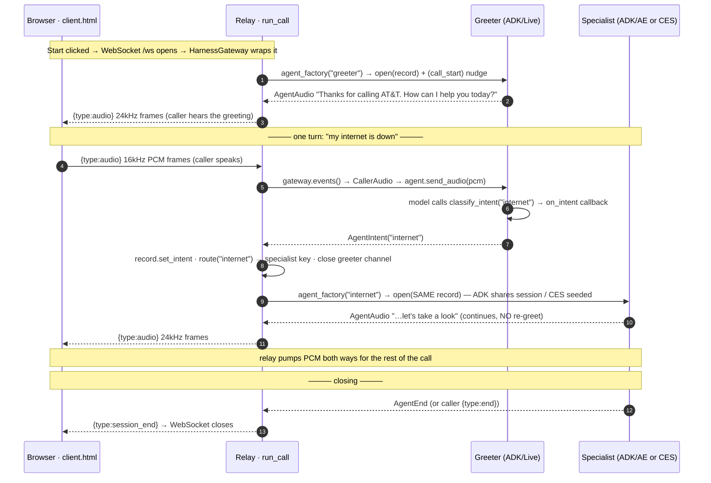

# AudioCodes → Multi-Agent Voice Steering

One inbound voice call, steered across **multiple AI back-ends on different platforms** — with no
audible re-greeting at each handoff. A caller dials in, a **greeter** classifies intent on the first
utterance, and the relay swaps the live audio to the right **specialist** — internet or phone-upgrade
(ADK + Gemini Live on Agent Engine) or billing (CX Agent Studio / CES) — while the caller hears one
continuous conversation. The routing decision is invisible.

Phase 1 uses a **browser mic harness** in place of an AudioCodes Media Gateway, so the full relay +
steering stack runs and is verifiable without any telephony infrastructure. Phase 2 swaps in a real
AudioCodes connection behind the same port — no change to the steering loop or the agents.

## What it is

A reference **steering relay** that proves two things:

1. **A single voice session can be routed to a specialist on _any_ GCP platform, seamlessly** —
   demonstrated by routing to agents hosted two different ways (ADK + Gemini Live, and CX Agent
   Studio) behind one identical relay. The relay's caller side, steering, and bookkeeping are the
   same regardless of back-end; only the per-agent `AgentSession` implementation differs. That
   sameness *is* the cross-platform proof.
2. **AudioCodes works as the media path over WebSockets** — the relay's caller side is written
   against a `MediaGateway` port whose end-state is the AudioCodes VoiceAI Connect (VAIC) Bot API.
   Phase 1 implements that port with a browser harness; Phase 2 implements it with AudioCodes.

The novel part (relay ↔ cross-platform agents, seamless) is built and verified first; telephony
onboarding is the last step. See `DESIGN.md` for the full spec and `PLAN-phase1.md` for the build plan.

## Features

- **Seamless linear handoff** — the specialist continues the caller's conversation with **no
  re-greeting** and no "welcome back". WS to the caller never drops; only the back-end channel is
  re-pointed.
- **Two ports, two drop-ins** — the relay core talks to a `MediaGateway` (caller side) and an
  `AgentSession` (agent side). Harness↔AudioCodes and ADK↔CES are each a port swap, not a rewrite.
- **Cross-platform agents behind one relay** — ADK/Gemini-Live specialists (Agent Engine) and a CES
  billing agent (`BidiRunSession`) are reached through the identical steering loop.
- **First-turn intent routing** — a one-shot greeter classifies intent via a tool call, then goes
  silent; after the swap the relay is a cheap audio pump and the specialist does the work.
- **Session-of-record** — the relay owns one `SessionRecord` per call. ADK specialists inherit the
  greeter's turns via a **shared session**; the CES specialist is **seeded** from the same record via
  `historicalContexts` (a different mechanism per boundary, by design).
- **Local or cloud, no code change** — one env var (`AE_ENGINE_ID`) flips the ADK agents between
  **in-process** `run_live` (local dev) and **Agent Engine** `bidi_stream_query` (hosted).
- **One-command deploy** — `deploy/deploy_all.sh` stands up the Agent Engine app + Cloud Run relay
  (idempotent, update-in-place); `deploy/destroy.sh` tears it down.
- **Smoke probes** — `scripts/smoke_*.py` verify each back-end channel end-to-end (CES bidi, ADK
  in-process, Agent Engine bidi) without the browser.

## How it works — voice flow

The browser harness opens **one WebSocket** to the **relay**. The relay owns that connection
(`MediaGateway`), runs the **steering loop**, and opens a **back-end voice channel** (`AgentSession`)
to whichever agent is active. The greeter classifies intent on the first turn; the relay closes the
greeter channel and opens the specialist channel **on the same session** — the caller hears one
continuous voice.

```
   ┌────────────────────────────┐        WebSocket  /ws         ┌──────────────────────────────────┐
   │      BROWSER HARNESS        │  ─────────────────────────▶   │        Relay (Cloud Run)         │
   │    harness/client.html      │   {type:audio} 16k PCM b64    │           relay/server.py        │
   │  mic 16kHz · play 24kHz     │   {type:end}                  │                                  │
   │                             │  ◀─────────────────────────   │  HarnessGateway  (MediaGateway)  │
   │                             │   {type:audio} 24k PCM b64    │  run_call()      (steering loop) │
   │                             │   {type:session_end}          │  SessionRecord   (of-record)     │
   └────────────────────────────┘                               └─────────────────┬────────────────┘
                                                            agent_factory(key) ──▶ │ AgentSession (channel #2)
                                  ┌──────────────────────────────────────────────┴───────────────────────┐
                                  │  STEERING LOOP  (relay/steering.py — run_call + intent routing)       │
                                  │  1. open Greeter → "Thanks for calling AT&T. How can I help you?"      │
                                  │  2. greeter calls classify_intent → AgentIntent → route(intent)        │
                                  │  3. close greeter channel · open specialist channel (same session)     │
                                  │  4. relay pumps PCM both ways for the rest of the call                 │
                                  └───────┬───────────────────────────┬───────────────────────────────────┘
                                          │ key ∈ {internet,           │ key == billing
                                          │        phone_upgrade}      │
                                          ▼ adk                        ▼ ces
              ┌───────────────────────────────────────────┐   ┌──────────────────────────────────┐
              │  ADK + Gemini Live specialist             │   │  CES billing specialist           │
              │  AeAdkSession   (Agent Engine bidi)  ⟵┐   │   │  CesBidiSession                   │
              │  AdkLiveSession (in-process run_live) ⟵┘   │   │  CES BidiRunSession WebSocket     │
              │  greeter · internet · phone_upgrade        │   │  ASR + LLM + TTS, server-managed  │
              └───────────────────────────────────────────┘   └──────────────────────────────────┘
                         AE_ENGINE_ID set → Agent Engine                seeded via historicalContexts
                         AE_ENGINE_ID unset → in-process
```

One call — *"my internet is down"* — from greeting to seamless specialist. The highlighted step is
the heart of the design: **the greeter channel is closed and the specialist channel opened on the
same `SessionRecord`**, so the specialist continues mid-conversation without re-greeting.



**Wire protocol** (Phase 1 harness — JSON text frames over the `/ws` WebSocket):

| Direction | Message | Meaning |
|---|---|---|
| browser → relay | `{type:"audio", data}` | mic frame, 16 kHz mono PCM16, base64 |
| browser → relay | `{type:"end"}` | caller hung up |
| relay → browser | `{type:"audio", data}` | agent audio, 24 kHz mono PCM16, base64 |
| relay → browser | `{type:"transfer", uri}` | human-escalation transfer (Phase 1: logged only; Phase 2: AudioCodes SIP `transfer`) |
| relay → browser | `{type:"session_end"}` | the call ended; the relay closes the socket |

## Transport — the back-end channel rides a different hop per platform

Voice needs audio flowing up (mic) and down (agent) continuously, so **every hop is a persistent
two-way channel**. Hop 1 (browser ⇄ relay) is always the same WebSocket. Hop 2 — the back-end voice
channel the relay opens — differs by which `AgentSession` is active:

```
  hop 1: WebSocket            hop 2: back-end voice channel (opened BY the relay)
  (browser ⇄ relay)
                        ┌───────────────────────────────────────────────────────────────┐
                        │  ADK on Agent Engine  →  gRPC bidi_stream_query  →  (hop 3)     │
 ┌─────────┐   ws://    │                            AgentEngine ⇄ Gemini Live (ws)       │
 │ BROWSER │◀─────────▶ │  ADK in-process (local) →  relay ⇄ Gemini Live (ws, run_live)   │
 │ harness │   RELAY    │                                                                 │
 └─────────┘            │  CES billing          →  relay ⇄ CES BidiRunSession (ws)        │
                        └───────────────────────────────────────────────────────────────┘
```

| Channel | `AgentSession` impl | Hop-2 transport | Notes |
|---|---|---|---|
| ADK on Agent Engine | `AeAdkSession` | gRPC `bidi_stream_query` (GenAI SDK); the live voice rides a 3rd hop — a Gemini Live WebSocket opened by ADK *inside* the Agent Engine container | active when `AE_ENGINE_ID` is set |
| ADK in-process (local dev) | `AdkLiveSession` | the relay's own `run_live` opens the Gemini Live WebSocket directly | active when `AE_ENGINE_ID` is unset |
| CES billing | `CesBidiSession` | a WebSocket from the relay straight to `wss://ces.googleapis.com/.../BidiRunSession` (ADC bearer) | always CES |

**Why a relay:** credentials stay server-side, it translates the harness JSON ⇄ each back-end stream,
and it is the **session-of-record** that makes the greeter→specialist handoff seamless. Flipping
`AE_ENGINE_ID` swaps the ADK hop-2 between in-process and Agent Engine with no code change.

## The two ports

The relay core (`relay/steering.py`) never names AudioCodes, Gemini, or CES — it speaks to two
`Protocol`s (`relay/ports.py`):

| Port | Role | Phase 1 impl | End-state / other impls |
|---|---|---|---|
| **`MediaGateway`** (caller side) | `events()` → `CallerAudio`/`CallerEnd`, `send_audio()`, `transfer()`, `end()` | `HarnessGateway` (browser WS) | `AudioCodesGateway` (VAIC Bot API WS) — Phase 2 |
| **`AgentSession`** (agent side) | `open(record)`, `send_audio()`, `events()` → `AgentAudio`/`AgentTranscript`/`AgentIntent`/`AgentEnd`, `close()` | `AdkLiveSession`, `AeAdkSession`, `CesBidiSession` | any future platform = one new impl |

## Session & context model

The relay is the **session-of-record**: one `SessionRecord` per call (keyed by `session_id`; a UUID
in the harness, derived from the AudioCodes `conversationId` in Phase 2). Continuity is delivered
differently per boundary — a deliberate, validated distinction:

| Boundary | Shared store? | Context mechanism |
|---|---|---|
| Greeter → ADK specialist (internet, phone_upgrade) | **Yes** | All ADK agents share one session service and the **same `session_id`** — in-process an `InMemorySessionService`, on Agent Engine a `VertexAiSessionService`. The specialist reads prior turns and appends to the same session. |
| Greeter → CES specialist (billing) | **No shared store** | CES owns its session server-side. The relay **seeds** the greeter transcript + intent via `historicalContexts` at connect (a repeated `ces.v1.Message` = `{role, chunks:[{text}]}`) and **captures** CES turns from `recognitionResult` / `sessionOutput`. The same id is reused as the CES session id for **correlation only**. |

Transcription is enabled on the ADK Live config so the greeter's spoken turns land in the session as
text the specialist can inherit.

## Running it

Three self-contained approaches (A, B, deploy) — each repeats its prerequisites so you can follow any
one start-to-finish. All three need the local `.venv` (the deploy scripts run on your machine). Run
everything from `audiocodes-to-adk-agent/`.

### Option A — local, in-process (no Agent Engine, no telephony)

ADK specialists run in-process via `run_live`; billing still uses CES. Leave `AE_ENGINE_ID` **unset**.

```bash
# create and activate the local venv
python3.12 -m venv .venv && source .venv/bin/activate

# install dependencies
pip install -r requirements.txt

# ADC for Vertex + CES
gcloud auth application-default login

# create .env, then set GOOGLE_CLOUD_PROJECT (+ region if not us-central1) and CES_APP
cp .env.example .env

# required for voice (TLS cert bundle)
export SSL_CERT_FILE=$(python -m certifi)
```

```bash
# terminal A — relay (in-process ADK agents) on :8080
uvicorn relay.server:app --port 8080

# terminal B — harness static server on :8000
python harness/serve.py
```

Open `http://localhost:8000/client.html`, click **Start call**, and speak. (Use **headphones** —
over speakers the agent's audio feeds back into the mic.)

> Billing needs `CES_APP` set and `speech.googleapis.com` + `texttospeech.googleapis.com` enabled on
> the project (CES does ASR/TTS on the audio path). Without `CES_APP`, internet/phone_upgrade still work.

### Option B — relay against Agent Engine (hosted ADK agents)

Same as A, but the ADK specialists run on Agent Engine. Deploy the multi-agent app once, then set
`AE_ENGINE_ID`:

```bash
# (prereqs as in Option A: venv, pip install, ADC, .env, SSL_CERT_FILE)

# deploy the ADK multi-agent app to Agent Engine (idempotent update-or-create).
# Run as a MODULE from the module root so relay.* / deploy.* and extra_packages resolve.
python -m deploy.deploy_agent_engine
# → prints the engine id and writes deploy/.engine_name; copy it into .env as AE_ENGINE_ID

# then run the relay + harness exactly as in Option A
uvicorn relay.server:app --port 8080
python harness/serve.py
```

### Deploy to Google Cloud (fully hosted)

One command stands up the back-end stack — the ADK multi-agent app on **Agent Engine** and the relay
on **Cloud Run** (WebSocket-capable, 15-min request timeout for the demo). All config comes from
`.env`; nothing is hardcoded.

```bash
# (prereqs as in Option A: venv, pip install, ADC, .env)

# enable the APIs the stack uses (once per project)
gcloud services enable aiplatform.googleapis.com run.googleapis.com cloudbuild.googleapis.com \
  artifactregistry.googleapis.com storage.googleapis.com ces.googleapis.com \
  speech.googleapis.com texttospeech.googleapis.com

# deploy the whole stack — prints the relay wss:// URL
bash deploy/deploy_all.sh
```

`deploy_all.sh` runs three idempotent steps, threading each step's output into the next: **(1)** ADK
multi-agent app → Agent Engine (`python -m deploy.deploy_agent_engine`; staging bucket auto-derived
from project id+number and created if missing), persisting the engine id to `.env`/`deploy/.engine_name`;
**(2)** validate/reference the **CES billing app** (`CES_APP`); **(3)** relay → Cloud Run
(`gcloud run deploy --source .`), wiring `AE_ENGINE_ID` + `CES_APP` into its env.

```bash
# tear it down — stops billing
bash deploy/destroy.sh
```

The **CES billing app** is provisioned once via the CX Agent Studio API (`ces-mcp` MCP tools, or the
console): `create_app` → `create_agent` (root) → `create_app_version` → `create_deployment`, then set
`CES_APP=projects/{project}/locations/{loc}/apps/{app}` in `.env`. See `deploy/NEXT-CES-BUILD.md`.

### The services

| # | Service | Platform | What it does |
|---|---|---|---|
| 1 | **ADK multi-agent app** | Agent Engine | greeter + internet + phone_upgrade as one Gemini-Live bidi app (`relay/agent_app.py`), custom `bidi_stream_query` mode. Reached by `AeAdkSession`. |
| 2 | **CES billing app** | CX Agent Studio (CES) | the billing specialist; published deployment served over `BidiRunSession`. Reached by `CesBidiSession`. |
| 3 | **Steering relay** | Cloud Run | the single browser endpoint (`/ws`). Owns the caller WebSocket, runs the steering loop, opens the back-end channel, is the session-of-record. WebSocket-capable; 15-min request timeout. |

## Config (`.env`)

| Var | Purpose |
|---|---|
| `GOOGLE_CLOUD_PROJECT` | **required** — target project |
| `GOOGLE_CLOUD_PROJECT_NUMBER` | used to derive the Agent Engine staging bucket |
| `GOOGLE_CLOUD_LOCATION` | Vertex region (default `us-central1`) |
| `LIVE_MODEL`, `LIVE_VOICE` | ADK Gemini Live model id + prebuilt voice (default `Charon`) |
| `AE_ENGINE_ID` | Agent Engine resource id for the ADK app; **unset → in-process** `run_live` |
| `CES_APP` | CES billing app resource name (`projects/.../apps/{app}`); empty → billing route inactive |
| `CES_LOCATION` | CES location (default `us`) |
| `STAGING_BUCKET` | override the auto-derived `{project}-{project_number}-agent-engine` bucket |

`.env` is gitignored — never hardcode environment values in tracked source (this prototype ships to a
customer). `.env.example` documents the keys with placeholders.

## Test

```bash
# unit suite (router, steering, ports, session record, bucket naming) — from the module root
pytest tests/ -v

# back-end channel smoke probes (need .env + SSL_CERT_FILE + ADC; CES needs CES_APP)
python tests/smoke/smoke_ces_bidi.py     # CES BidiRunSession: ASR → billing reply → TTS audio
python tests/smoke/smoke_ae_live.py      # ADK on Agent Engine (bidi_stream_query)
python tests/smoke/smoke_adk_live.py     # ADK in-process (run_live)
```

`tests/smoke/make_sample_wav.py` regenerates `tests/smoke/sample_16k.wav` (the smoke fixture) via Cloud TTS.

> CES bidi audio note: the agent only replies after endpointing detects end-of-speech, which needs
> **continuous audio** — a client that stops sending stalls and the session times out after 30s. The
> smoke streams trailing silence after the clip; a real call streams audio continuously.

## Phase 2 — AudioCodes drop-in

Phase 2 replaces `HarnessGateway` with an `AudioCodesGateway` implementing the VAIC Bot API WebSocket
contract (`session.initiate`/`accepted`, `userStream`/`playStream`, `transfer`, `session.resume`),
onboards a VAIC self-service tenant + US test DID, and points its bot at the relay. A real PSTN call
then runs the identical Phase-1 flow — the steering loop, agents, and session model are untouched.
See `DESIGN.md` §4a and §9.
</content>
</invoke>
